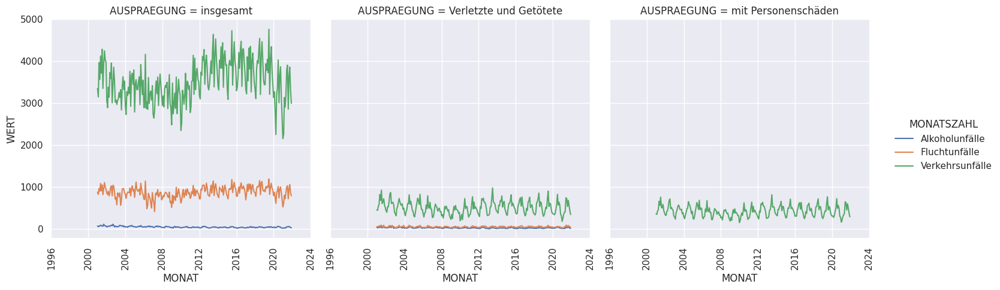
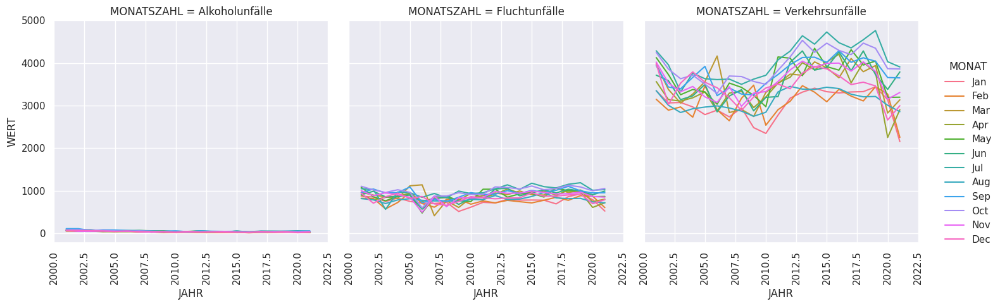

# Munich Traffic Accidents Analysis

## Data Visualization
In the following figures data are visualised:
|  |
|:--:|
| *Fig.1 - Monthly* |

||
|:--:|
| *Fig.2 - Monthly detailed (insgesamt)* |

It is clear that only  ***Verkehrsunfalle*** category has the sub-caegory ***Auspraegung*** which could be rid of in case of training a machine learning model.

## Building a predictive model
First data is preprocessed as follows:
1. read data as a dataframe
2. rows with missing values dropped
3. keeping only the features: `MONATSZAHL`, `AUSPRAEGUNG`, `JAHR`, `MONAT`, `WERT`.
4. transform categorical data `MONATSZAHL`, `AUSPRAEGUNG` into new columns and drop the original columns.
5. min-max normalization is applied to `JAHR`, `MONAT`, `WERT`.
6. data train-test split
7. train a shallow neural network with 3 hidden layers and one output layer. As the output is normalized, the output activation function is sigmoid. You can see the learning curve in *fig.3*:

## Deployment
for training I use GCP Vertex AI following the steps in [here](https://github.com/SohilZidan/dps-vertex-ai)\
deploy the mode using the command:
```bash
python3 deploy.py | tee deploy-output.txt
```

## Prediction API
the current version requires input features normalization and output prediction denormalization (read [predict.py](predict.py))


